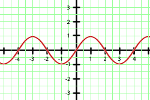
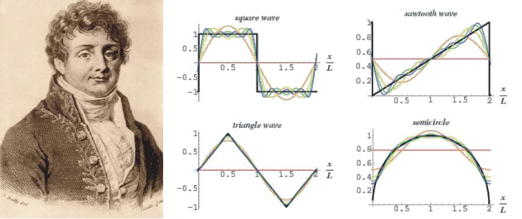

# Desarollo de un sistema electrónico para la adquisicion de una señal EEG

Se busca que a partir de un sistema DAQ, se obtengan senales EEG en sistemas embebidos empleando lenguaje C.

# Índice

- [Función periódica](#funcion-periódica)
- [Serie trigonométrica de Fourier](#serie-trigonométrica-de-fourier)

## Funcion Periódica [^](#índice)

Una **función periódica** es una función que se repite en intervalos regulares. Es decir, existe un número positivo $\ ( T )$ tal que:

$$
f(x + T) = f(x) 
$$

para todos los $\ ( x )$ en el dominio de la función. Este número $\ ( T )$ se denomina **período** de la función.

### Ejemplos de Funciones Periódicas

1. **Función Seno**:
   - La función seno es periódica con un período de $\ ( 2\pi )$:
   $
   f(x) = \sin(x)
   $

2. **Función Coseno**:
   - La función coseno también tiene un período de $\ ( 2\pi )$:
   $
   f(x) = \cos(x)
   $

### Propiedades

- **Amplitud**: La amplitud de una función periódica es la distancia máxima desde el eje horizontal hasta el valor máximo o mínimo de la función.
- **Frecuencia**: La frecuencia $\ ( f )$ es el número de ciclos que ocurren en un intervalo de tiempo dado. Está relacionada con el período $\ ( T )$ mediante la fórmula:
$$
f = \frac{1}{T}
$$

### Aplicaciones

Las funciones periódicas son comunes en diversas áreas, incluyendo:

- **Física**: Descripción de ondas y oscilaciones.
- **Ingeniería**: Análisis de señales.
- **Matemáticas**: Teoría de Fourier y series de Fourier.

## Serie trigonométrica de Fourier [^](#índice)

La **serie trigonométrica de Fourier** es una representación de funciones periódicas como una suma infinita de senos y cosenos. Es fundamental en el análisis de señales y en la teoría de Fourier.

### Definición

Si $\ ( f(x) )$ es una función periódica con período $\ ( 2L )$, su serie de Fourier se expresa como:

$$
f(x) = a_0 + \sum_{n=1}^{\infty} \left( a_n \cos\left(\frac{n \pi x}{L}\right) + b_n \sin\left(\frac{n \pi x}{L}\right) \right)
$$

donde:

- $\ ( a_0 )$ es el coeficiente constante:
  $$
  a_0 = \frac{1}{2L} \int_{-L}^{L} f(x) \, dx
  $$

- $\ ( a_n )$ son los coeficientes de coseno:
  $$
  a_n = \frac{1}{L} \int_{-L}^{L} f(x) \cos\left(\frac{n \pi x}{L}\right) \, dx
  $$

- $\ ( b_n )$ son los coeficientes de seno:
  $$
  b_n = \frac{1}{L} \int_{-L}^{L} f(x) \sin\left(\frac{n \pi x}{L}\right) \, dx
  $$

### Ejemplo

Si tomamos una función \( f(x) \) periódica con un período de \( 2\pi \) (es decir, \( L = \pi \)), la serie de Fourier se convierte en:

$$
f(x) = a_0 + \sum_{n=1}^{\infty} \left( a_n \cos(nx) + b_n \sin(nx) \right)
$$

Los coeficientes se calculan como:

$$
a_0 = \frac{1}{2\pi} \int_{-\pi}^{\pi} f(x) \, dx
$$

$$
a_n = \frac{1}{\pi} \int_{-\pi}^{\pi} f(x) \cos(nx) \, dx
$$

$$
b_n = \frac{1}{\pi} \int_{-\pi}^{\pi} f(x) \sin(nx) \, dx
$$

### Aplicaciones

Las series de Fourier son utilizadas en diversas áreas, tales como:

- Procesamiento de señales
- Análisis de sistemas lineales
- Teoría de vibraciones
- Resolución de ecuaciones diferenciales
