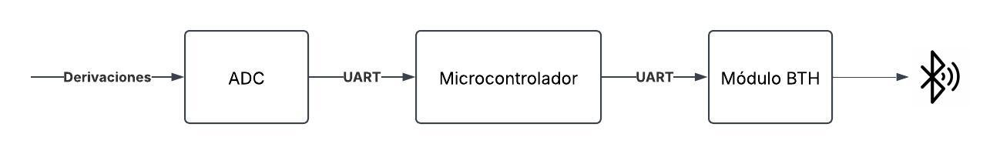
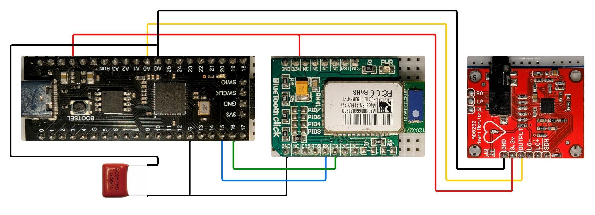
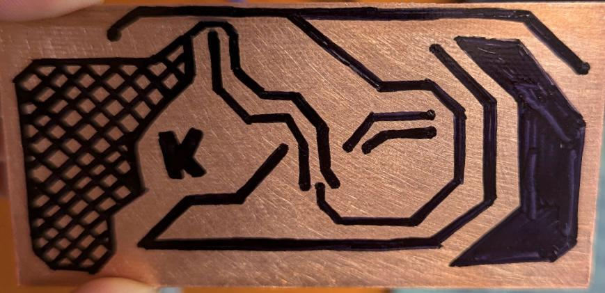
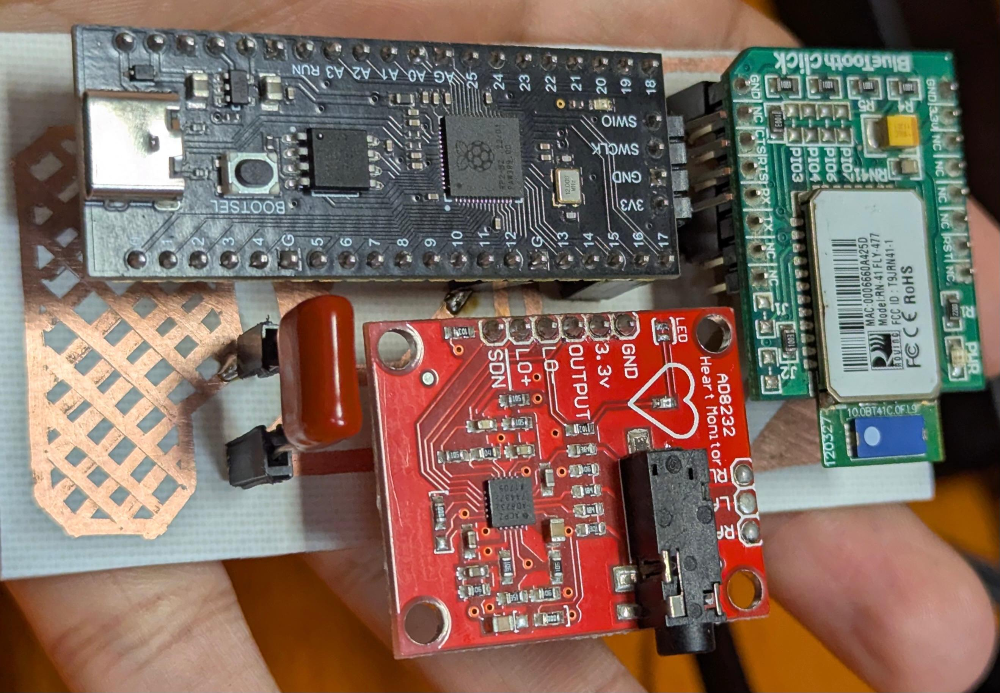
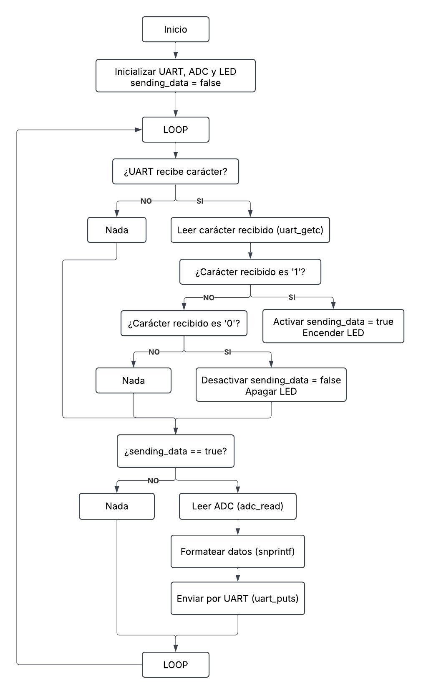

# Índice
# 1. Introducción

 En el presente proyecto se plantea el desarrollo de un sistema de adquisición de datos (DAQ) especializado en la obtención de señales electrocardiográficas (ECG) mediante el uso de sistemas embebidos y el lenguaje de programación C. Este sistema está diseñado para capturar la señal ECG de una persona, transmitirla a una computadora para su visualización y análisis, y, mediante algoritmos, detectar posibles anomalías cardíacas. A continuación, se abordan los aspectos clave del proyecto, incluyendo sus objetivos, importancia, y alcance, así como los fundamentos teóricos necesarios para su desarrollo.

## 1.1. Objetivos del proyecto  

Desarrollo de un sistema electrónico para la adquisición de una señal ECG y un sistema de adquisición de datos (DAQ) para la obtención y procesamiento de señales ECG en tiempo real, utilizando sistemas embebidos programados en lenguaje C. Se busca que el sistema capture de manera precisa las señales electrocardiográficas de una persona, las transmita a una computadora para su visualización, y aplique algoritmos para analizar las señales y detectar posibles anomalías cardíacas. 

## 1.2. Justificación  

El desarrollo de un sistema de adquisición de señales electrocardiográficas (ECG) basado en sistemas embebidos y procesamiento digital de señales responde a la necesidad de contar con herramientas accesibles y eficientes para la investigación biomédica. Actualmente, la adquisición y análisis de señales ECG requiere equipos de alto costo, diseñados principalmente para aplicaciones médicas certificadas. Este proyecto busca ofrecer una alternativa basada en hardware de bajo costo, manteniendo una alta precisión en la captura y procesamiento de datos.  

## 1.3. Importancia de la adquisición de señales ECG  

La adquisición de señales electrocardiográficas (ECG) es fundamental en el monitoreo y diagnóstico de enfermedades cardiovasculares. Un sistema de adquisición de ECG permite registrar la actividad eléctrica del corazón a través de electrodos colocados en la piel, proporcionando información clave sobre el ritmo y la función cardíaca. La precisión en la adquisición de estas señales es esencial, ya que cualquier interferencia o ruido puede afectar la interpretación de los datos, lo que podría llevar a diagnósticos erróneos (García et al., 2015).

El desarrollo de sistemas de adquisición de ECG ha evolucionado significativamente gracias a los avances en electrónica y procesamiento de señales. La implementación de filtros digitales y amplificadores de instrumentación ha mejorado la calidad de las señales obtenidas, permitiendo una detección más precisa de anomalías como arritmias y bloqueos cardíacos (Rodríguez & López, 2020). Además, la integración de sistemas embebidos y la transmisión de datos en tiempo real han facilitado el monitoreo remoto, beneficiando a pacientes con enfermedades crónicas y reduciendo la necesidad de hospitalización (Fernández et al., 2018).

La importancia de la adquisición de señales ECG también radica en su uso en el ámbito de la investigación biomédica y el desarrollo de tecnologías médicas innovadoras. Los sistemas modernos de adquisición no solo permiten visualizar las señales en tiempo real, sino que también posibilitan el análisis automatizado mediante algoritmos de inteligencia artificial, mejorando la detección temprana de patologías (Martínez et al., 2019). Estos avances refuerzan la necesidad de continuar optimizando los sistemas de adquisición para lograr registros cada vez más precisos y accesibles en entornos clínicos y domésticos.

# 2. Fundamentos Teóricos

## 2.1 Frecuencia cardiaca  
## 2.2 Triángulo de Einthoven  
## 2.3 Electrocardiograma (ECG)  
## 2.4 Filtros digitales    
## 2.5 Convertidor ADC  
## 2.6 Sistemas de Adquisición de Datos (DAQ)  
## 2.7 Comunicación serie UART/Bluetooth

---

# ⚙️ 3. DAQ



---

## 🔩 3.1 Componentes

### ➤ **Electrodos: Ambiderm T715**  
Electrodos desechables autoadheribles diseñados para la adquisición de señales bioeléctricas.  
- Fabricados en espuma de **polietileno**.  
- Incorporan un broche de conexión metálico tipo botón que facilita su integración con cables de monitoreo.  
- Diseño redondo de **55 mm** de diámetro.

---

### ➤ **Cable de Electrodo DC 3.5 mm**  
Cable de transmisión de señales bioeléctricas utilizado para conectar los electrodos al módulo de acondicionamiento y conversión analógica-digital.  
- Dispone de un conector **3.5 mm tipo jack**.  
- Su función es transportar las señales captadas por los electrodos al módulo **AD8232**.

---

### ➤ **Módulo AD8232**  
Módulo de adquisición de señales bioeléctricas especializado en la medición de la actividad eléctrica del corazón.  
- Integra un **amplificador**.  
- Incluye filtros **pasa bajos** y **pasa altos**.  
- Sistema de rechazo de **modo común** para minimizar interferencias.  

---

### ➤ **Módulo Bluetooth RN-41-FLY-477**  
Módulo de comunicación inalámbrica **Bluetooth Clase 1**, ideal para transmisión de datos a larga distancia.  
- Alcance de hasta **100 metros**.  
- Interfaz de comunicación **UART**.  
- Bajo consumo energético.

---

### ➤ **Capacitor de Poliéster 0.1 µF a 250V**  
Componente pasivo utilizado para **acoplamiento capacitivo**.  
- Bloquea la corriente continua (**DC**).  
- Permite el paso de la señal alterna (**AC**), aislando diferentes etapas del sistema.  
- Elimina **offsets** no deseados y reduce el ruido generado por la componente continua de la señal.

---

## 🧠 3.2 Microcontrolador

### ➤ **Raspberry Pi Pico**  
La **Raspberry Pi Pico** es una placa de desarrollo compacta basada en el **microcontrolador RP2040**, diseñado por Raspberry Pi.  
Integra un procesador **ARM Cortex-M0+ de doble núcleo**, operando a una frecuencia de hasta **133 MHz**.

---

#### 📌 **Características principales:**

- **Memoria**:  
  - 264 KB de **SRAM**.  
  - Soporte para hasta **16 MB** de memoria **Flash externa** mediante interfaz **QSPI**.  

- **Entradas/Salidas (GPIO)**:  
  - 26 pines **GPIO** multifunción.  
  - 3 pines configurables como entradas analógicas para el **ADC de 12 bits**.  

- **Interfaces de comunicación**:  
  - **UART (2)**: Comunicación serial asíncrona.  
  - **SPI (2)**: Comunicación síncrona de alta velocidad.  
  - **I2C (2)**: Comunicación en bus compartido para múltiples dispositivos.  

- **Conversores Analógico-Digital (ADC)**:  
  - 3 canales **ADC** de **12 bits**, útiles para la adquisición de señales analógicas.

---

#### 📌 **Programación y compatibilidad:**  
- Compatible con **MicroPython** y **C/C++**.  
- Soporte en entornos de desarrollo como **Thonny**.  
- Dispone de **SDK oficial** para C/C++, facilitando la implementación de aplicaciones en sistemas embebidos.

---

## 🔋 3.3 Fuente de Alimentación  

Para el correcto funcionamiento del **DAQ**, es necesario suministrar una fuente de alimentación de **5V**, la cual se entrega a través del **puerto USB tipo C** de la **Raspberry Pi Pico**.

✅ Durante las pruebas:  
- Se alimentó directamente desde un puerto **USB** de PC.  
- Posteriormente, se alimentó desde una **powerbank**, asegurando la portabilidad del sistema.

---

## 🔌 3.4 Conexión de Componentes  



---

## 🖨️ 3.5 Diseño de Placa

| **Diseño Base**                             | **Montaje de Componentes**                      |
|---------------------------------------------|-------------------------------------------------|
|  |  |

---

## ⚡ 3.6 Funcionamiento

1. Los **electrodos desechables Ambiderm T715** se colocan sobre la piel del paciente según el **Triángulo de Einthoven**. Estos electrodos recogen las pequeñas variaciones de potencial generadas por la actividad eléctrica cardiaca.

2. El **cable de electrodo DC 3.5 mm**, con sus tres terminaciones, se conecta de acuerdo al Triángulo de Einthoven. El cable transmite la señal desde los electrodos hacia el módulo **AD8232**.

3. El módulo **AD8232** procesa la señal captada:
   - **Filtra** la señal para eliminar el ruido de alta frecuencia.
   - **Amplifica** la señal bioeléctrica.
   - Reduce el ruido gracias al **capacitor de poliéster de 0.1 µF**, que realiza el acoplamiento de señal, bloqueando la corriente continua (**DC**) y permitiendo el paso de la componente alterna (**AC**).

4. La señal, ya filtrada y amplificada, se envía al microcontrolador **Raspberry Pi Pico** a través del **pin GPIO 26 (A0)**.  
   El **ADC** de la Raspberry Pi Pico convierte esta señal analógica en valores digitales de **12 bits** para su posterior procesamiento.

5. Una vez digitalizada y procesada, la señal es transmitida vía **UART** a través de los pines **TX y RX**. Estos pines están conectados al módulo **Bluetooth RN-41-FLY-477**, que envía los datos de manera inalámbrica al sistema operativo receptor.

---

# 📦 4. Configuración del Entorno de Desarrollo

---

## ⚙️ 4.1 Hardware para el Desarrollo

| **Componente** | **Especificación** |
|----------------|--------------------|
| 💻 **Laptop**  | Dell G15 5515 |
| 🧠 **Procesador (CPU)** | Ryzen 7 5800H (8 núcleos / 16 hilos, hasta 4.2 GHz) |
| 🎮 **Gráficos (GPU)** | NVIDIA GeForce RTX 3060 (6GB GDDR6) |
| 🧩 **Memoria RAM** | 16 GB DDR4, 3200 MHz |
| 💾 **Almacenamiento** | SSD NVMe M.2 de 512 GB |

---

## 🐧 4.2 Sistema Operativo: Pop!_OS

> **Versión:** Pop!_OS 22.04 LTS  
> **Kernel:** 6.9.3-76060903-generic  

Todo el desarrollo de código se llevo a cabo en la distrubución de linux Pop! Os, es gratuita y de código abierto, basada en ubuntu, desarrollada por **System76**, se utilizó esta debido a su estabilidad que tiene, recibe actualizaciones constantes, el **kernel** que tiene está actualizado para usarse con controladores gráficos de **NVIDIA** y **AMD**. Además, está optimizada para **cómputo científico**, **desarrollo de software** e **inteligencia artificial**.

### 🔗 Instalación de Pop!_OS  
👉 [Descargar Pop!_OS](https://pop.system76.com/)

### 🛠️ Pasos posteriores a la instalación:
1. **Actualizar el sistema**:
    ```bash
    sudo apt update && sudo apt upgrade
    ```
2. **Agregar usuario al grupo dialout** (para acceso a dispositivos de comunicación serie):
    ```bash
    sudo usermod -a -G dialout $USER
    ```

---

## 📝 4.3 IDE: Visual Studio Code

> **Versión:** 1.96.0  


Es un editor de código muy utilizado, agradable usabilidad, se le puede añadir múltiples extensiones que permiten generar código de mejor forma y más rápido.

### ⚡ Instalación y actualización:
1. **Instalar VS Code**:
    ```bash
    sudo apt install code
    ```
2. **Actualizar a la última versión**:
    ```bash
    sudo apt upgrade code
    ```

---

## 💻 4.4 Lenguajes de Programación: C y Python

En el proyecto se usaron **dos lenguajes** según la necesidad de desempeño y facilidad de desarrollo:

| **Lenguaje** | **Uso** |
|--------------|---------|
| 🐍 **Python** | En un inicio se utilizó el lenguaje **Python** con ayuda de **MicroPython** por medio de **Thonny** para programar la **Raspberry Pi Pico**, pero debido a que python es interpretado, hace que sea más lento. Donde si se utilizó python fue en el desarrollo del programa de adquisión, guardado y visualización de datos debido a su simplicidad y que contiene una amplia variedad útiles de librerías. |
| ⚙️ **C** | Debido a la desventaja de Python, se decidió utilizar el lenguaje **C** para realizar toda la programación. Como ventajas de utilizar **C** es que al ser **compilado**, significa que se ejecuta directamente en el **hardware**, lo que hace que tenga un mejor desempeño. Teniendo un impaco directo en el dispositivo especificamente en la cantidad de datos enviados al programa. |

### 🐍 Instalación de Python 3 y pip:

```bash
sudo apt install python3
sudo apt install python3-pip
```

---


## ⚙️ 4.5 Generación de Proyecto en C

Para la generación del proyecto se utilizó **Pico Project Generator**. Para esto, antes, fue necesario haber instalado el **SDK de Raspberry Pi**.  
**Pico Project Generator** permite crear proyectos en **C** para múltiples boards de una manera más sencilla, mediante una interfaz gráfica.

---

### 📝 Pasos para la creación del proyecto en C:

1. **Descargar el SDK para Raspberry Pi:**  
   [👉 pico.sh](https://github.com/kejoperezde/Servicio/blob/3e0f7b95ebaf8ff6d712780103dedfb72edc734b/PICO/pico.sh)

2. **Ejecutar los siguientes comandos en la ubicación donde se descargó el script:**
   ```bash
   chmod +x pico.sh
   ./pico.sh
   ```

3. **Clonar el repositorio de Pico Project Generator:**
   ```bash
   git clone https://github.com/raspberrypi/pico-project-generator.git
   cd pico-project-generator
   ```

4. **Ejecutar Pico Project Generator:**
   ```bash
   ./pico-project.py --gui
   ```

5. En la interfaz gráfica, configurar:
   - **Board type:** `pico2`  
   - **Librerías:** seleccionar `SPI`  

---

## 🐍 4.6 Instalación y Utilización de Librerías en Python

Las librerías utilizadas en el desarrollo Python, tanto para **procesamiento de datos**, **comunicación serie**, como para la **creación de interfaces gráficas**.

---

### 📦 Librerías que requieren instalación

Ejecutar el siguiente comando para instalar las librerías desde `pip`:
```bash
pip install matplotlib pandas pyserial scipy numpy
```

Instalar `tkinter` desde el administrador de paquetes:
```bash
sudo apt-get install python3-tk
```

---

### 📚 Librerías incluidas en la biblioteca estándar de Python

Estas librerías no requieren instalación adicional:  
- `os`  
- `csv`  
- `time`  
- `subprocess`  
- `shutil`  
- `math`  

---

### 📝 Descripción y uso de las librerías

| **Librería**   | **Uso**                                                                                             |
|----------------|-----------------------------------------------------------------------------------------------------|
| `matplotlib`   | Generación de gráficos 2D, como gráficos de líneas.                                                 |
| `pandas`       | Lectura y escritura de archivos CSV.                                                                |
| `pyserial`     | Comunicación serie, envío y recepción de datos a través de puertos (/dev/rfcomm0).                  |
| `scipy`        | Procesamiento de señales, obtención y análisis de datos desde archivos `.mat`.                      |
| `numpy`        | Operaciones numéricas sobre arreglos y matrices.                                                    |
| `tkinter`      | Creación de interfaces gráficas (GUI).                                                              |
| `os`           | Interacción con el sistema operativo: manejo de archivos, directorios y procesos.                   |
| `csv`          | Lectura y escritura de archivos CSV.                                                                |
| `time`         | Funciones relacionadas con el tiempo.                                                               |
| `subprocess`   | Ejecuta procesos y comandos del sistema operativo desde Python.                                     |
| `shutil`       | Realizar operaciones  con archivos y directorios. Copiae, mover y eliminar archivos y directorios.  |
| `math`         | Funciones matemáticas básica.                                                                       |

---

## 🛠️ 4.7 Utilidades

Herramientas para facilitar el desarrollo y la administración del entorno de trabajo.

---

### 📡 **Blueman**  
> Administrador de **Bluetooth** para sistemas **Linux**.

- **Versión utilizada:** `2.2.4`

#### 🔧 Instalación
```bash
sudo apt install blueman
```

---

### 🔲 **Screen**  
> Herramienta para gestionar sesiones de terminal, ideal para la comunicación en **puertos serie**.

#### 🔧 Instalación
```bash
sudo apt install screen
```

#### 📡 Visualización de sesión (datos recibidos)
```bash
sudo screen /dev/K
```
> `K` es el nombre del dispositivo de entrada.

---

### 🐍 **Thonny**  
> Entorno de Desarrollo Integrado (**IDE**) diseñado para programar en **Python**, especialmente útil con **MicroPython**.

#### 🔧 Instalación
```bash
sudo apt install thonny
```

---

### 🐧 **Actualizar Linux Firmware**  
> Proceso para mantener el firmware de Linux actualizado, asegurando compatibilidad y soporte con hardware reciente.

#### 📥 Descargar última versión
👉 [linux-firmware](https://git.kernel.org/pub/scm/linux/kernel/git/firmware/linux-firmware.git "linux-firmware")

#### 📦 Extraer contenido del archivo descargado
```bash
tar -xvf nombre_archivo.tar.yz
```

#### 📂 Reemplazar archivos de firmware
```bash
sudo cp -r /linux-firmware-####/* /lib/firmware
```
> Sustituir `####` por el número de versión correspondiente al firmware descargado.

---

### 🔌 **Ver Dispositivos Conectados**

| **Acción**                          | **Comando**               |
|-------------------------------------|---------------------------|
| Ver todos los dispositivos `tty`    | `ls /dev/tty*`            |
| Ver dispositivos USB `ttyUSB`       | `ls /dev/ttyUSB*`         |
| Ver dispositivos Bluetooth `rfcomm` | `ls /dev/rfcomm*`         |

---

### 🔥 PyTorch con GPU NVIDIA 

Guía básica para instalar los componentes necesarios para usar **PyTorch** con soporte de **GPU NVIDIA** en Linux.

---

#### 1. CUDA Toolkit

🔗 [Descargar CUDA para Ubuntu 22.04 (x86_64, deb local)](https://developer.nvidia.com/cuda-downloads?target_os=Linux&target_arch=x86_64&Distribution=Ubuntu&target_version=22.04&target_type=deb_local)

> **Nota:** Verifica que la versión sea compatible con tu tarjeta gráfica y PyTorch. Por lo general, PyTorch soporta CUDA 11.x hasta 12.1 de manera oficial.

---

#### 2. cuDNN (CUDA Deep Neural Network Library)

🔗 [Descargar cuDNN para CUDA 12 (Ubuntu 22.04, x86_64, deb local)](https://developer.nvidia.com/cudnn-downloads?target_os=Linux&target_arch=x86_64&Distribution=Ubuntu&target_version=22.04&target_type=deb_local)

> **Importante:** Asegúrate de descargar la versión que corresponda a la versión de CUDA instalada.

---

#### 3. Scikit-learn (opcional)

🔗 [Guía de instalación de Scikit-learn 1.5](https://scikit-learn.org/1.5/install.html)

bash
pip install scikit-learn

---

# 🖥️ 5. Programación del Sistema Embebido: C

---

## 🔧 5.1 Lectura y Adquisición de Datos

Primero se inicializa en C, el **ADC** del microcontrolador, después se configura el pin de la entrada analógica, que en este caso es el `GPIO 26`, y se selecciona el canal 0 del ADC que corresponde al `GPIO 26`.

Hay un bucle principal, que cuando la variable que recibe la señal que hace que envíe datos es verdadera, hace la lectura del **ADC** de forma constante, lee el valor digitalizado del ADC, aquí se realiza una conversión analógica-digital, y deja de tomar la lectura cuando la variable es falsa. Específicamente toma la tensión presente del pin `GPIO 26` y la convierte en un valor numérico digital de **12 bits**, que puede ir de `0` a `4095`, donde `0` representa `0V` (el voltaje mínimo del rango del ADC), y `4095` representa `3.3V` (el voltaje de referencia máximo en el ADC del Raspberry Pi Pico).

---

## 📡 5.2 Transmisión de Datos: Comunicación en Serie / Bluetooth

La transmisión de datos se realiza de la siguiente forma: primeramente se inicializan variables que son la **UART**, el **ADC** y el **LED**, después entra a un bucle infinito que verifica constantemente si recibe el valor de `'1'` o `'0'`. En caso de que reciba un `'1'`, empieza a enviar el valor capturado por el **ADC** y enciende el **LED** como método físico de verificación de que se está haciendo el envío de datos. Si recibe un `'0'`, detiene el envío de datos y apaga el **LED**.

El envío de datos se realiza mediante **UART** al módulo **Bluetooth**, que a su vez se encarga de enviarlo al sistema operativo al que fue conectado por este mismo protocolo.

En un inicio estaba programado para que constantemente enviara los datos, pero esto generaba la desconexión del Bluetooth. Investigando y haciendo pruebas, se descubrió que el hecho de que el sistema operativo (en este caso **PopOS** y **Ubuntu**, que fue en los dos probados), al identificar que inmediatamente un dispositivo Bluetooth enviaba una gran cantidad de datos después de haber sido conectado, lo desconectaba. Por lo que se optó que primero el dispositivo esperara a recibir un `'1'`, para que posteriormente empezara a enviar datos, y después recibir un `'0'` para que dejara de enviar.

---

## ⚙️ 5.3 Resolución, Frecuencia de Muestreo

- **Resolución del ADC:** 12 bits (la conversión analógica-digital puede tomar valores de `0` a `4095`)  
- **Frecuencia de muestreo:** 192 Hz  
- **Tasa de baudios (UART):** 9600 bps  
- **Bits por muestra:** 50 bits (envío de muestra)

La velocidad depende de las capacidades del microcontrolador, ejecución del `adc_read()`, `snprintf()` y `uart_puts()`, y el ancho de banda de **UART**.

Se usó ese valor de baudios ya que posteriormente los datos son enviados por Bluetooth.

```plaintext
5 caracteres × 10 bits = 50 bits por muestra  
9600 bits por segundo / 50 bits por muestra = 192 muestras por segundo
```

---

## 🔧 5.4 Diagrama de flujo



## 📝 5.5 Pseudocódigo

```plaintext
// Inicialización del hardware
Inicializar UART en BAUD_RATE (9600)
Configurar pines UART_TX_PIN (16) y UART_RX_PIN (17)

Inicializar ADC
Configurar ADC_PIN (GPIO 26)
Seleccionar canal de entrada del ADC (canal 0)

Inicializar LED en LED_PIN (GPIO 25)
Configurar LED como salida
Apagar LED

// Variable de control
sending_data ← FALSO

// Bucle principal
MIENTRAS VERDADERO HACER

    SI hay datos recibidos en UART ENTONCES
        received_char ← leer carácter de UART
        
        SI received_char ES '1' ENTONCES
            sending_data ← VERDADERO
            Encender LED
        FIN SI
        
        SI received_char ES '0' ENTONCES
            sending_data ← FALSO
            Apagar LED
        FIN SI
    FIN SI

    SI sending_data ES VERDADERO ENTONCES
        adc_value ← leer ADC (valor de 0 a 4095)
        
        buffer ← convertir adc_value en texto
        
        Enviar buffer por UART
        
        Esperar 1 milisegundo (opcional)
    FIN SI

FIN MIENTRAS

FIN
```
---

# 6. Desarrollo de la aplicación en Python
## 6.1 Estructura del programa  


## 6.2 Lectura de datos transmitidos desde el DAC  
## 6.3 Interfaz de usuario
## 6.4 Controles de interacción (inicio/detención de adquisición)  
## 6.5 Guardado de datos a CSV
## 6.6 Filtrado digital (Butterworth)  
## 6.7 Visualización de datos

## 7. BD MIT BIH
### 7.1 Obtención de datos
### 7.2 WFDB2MAT
### 7.3 Procesado y guardado de muestras
### 7.4 Obtención de datos muestras

## 8. Resultados

## 9. Referencias

## 10. Anexos
### 10.1 Códigos fuente  

C

```C
#include <stdio.h>
#include "hardware/uart.h"
#include "hardware/adc.h"
#define UART_ID uart0
#define BAUD_RATE 9600
#define UART_TX_PIN 16
#define UART_RX_PIN 17
#define LED_PIN 25
#define ADC_PIN 26
bool sending_data = false;
int main(){
    uart_init(UART_ID, BAUD_RATE);
    gpio_set_function(UART_TX_PIN, GPIO_FUNC_UART);
    gpio_set_function(UART_RX_PIN, GPIO_FUNC_UART);
    adc_init();
    adc_gpio_init(ADC_PIN);
    adc_select_input(0);
    gpio_init(LED_PIN);
    gpio_set_dir(LED_PIN, GPIO_OUT);
    gpio_put(LED_PIN, 0);
    char received_char;
    while(true){
        if(uart_is_readable(UART_ID)){
            received_char = uart_getc(UART_ID);
            if(received_char == '1'){
                sending_data = true;
                gpio_put(LED_PIN, 1);
            }
            if(received_char == '0'){
                sending_data = false;
                gpio_put(LED_PIN, 0);
            }
        }
        if(sending_data){
            uint16_t adc_value = adc_read();
            char buffer[10];
            snprintf(buffer, sizeof(buffer), "%u\n", adc_value);
            uart_puts(UART_ID, buffer);
        }
    }
}
```
### 10.2 Gráficos adicionales  

Imágenes [One Drive](https://1drv.ms/f/s!AsP3n41dk7dYgeCnVOpamzrRtiJD-2o?e=4rbqUR).

## 11. Errores comunes y soluciones
### 11.1 Problemas en la adquisición de datos  
### 11.2 Fallos en la comunicación serie/Bluetooth  
### 11.3 Interferencias en la señal ECG  

